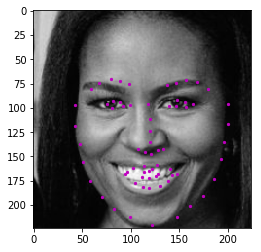

# face_keypoint_detection

## Motivation
I strongly believe in the positive impact of AI, Deep Learning, and Computer Vision on our lives. 
From self-driving cars to health care and early diagnosis.

I did this project during Computer Vision Nanodegree at Udacity. My goal was to build a facial keypoint detection system and define its CNN architecture.
I achieved with my prototype solid performance after just 10 minutes of training on GPU. For industry application, longer training would be required.

## Usage
- You can retrain the network and save the model from `Notebook 2`. To train it in a feasible time, you should run it on GPU. The 7 epochs took 10 minutes on GPU. You will need to download data for training from here [here](https://github.com/udacity/P1_Facial_Keypoints/tree/master/data)
- You can use the model you trained in `Notebook 3` to detect keypoints for any image of your choice.

## Libraries used
Python 3
- numpy
- torch
- matplotlib

## Files in the repository
- `Notebook 1`   : Loading and Visualizing the Facial Keypoint Data
- `Notebook 2`   : Defining and Training a Convolutional Neural Network (CNN) to Predict Facial Keypoints
- `Notebook 3`   : Facial Keypoint Detection Using Haar Cascades and your Trained CNN
- `Notebook 4`   : Fun Filters and Keypoint Uses
- `data_load.py` : Auxualiary functions to load data and their augmentation
- `Models.py`    : CNN Architecture definition

___
## Project description: detail steps

For facial keypoints detection, I used Adam optimizer. It appeared to perform better than SGD after one epoch of training. For the loss function, I used Smooth L1 Loss which is suitable for regression problems like this.

For CNN architecture, first I used a simple architecture consisting of:

- `(conv1): Conv2d`
- `(pool1): MaxPool2d`
- `(fc1): Linear`

The training was fast, but results needed improvement. To achieve this, I extended the network to consist of:

- `(conv1): Conv2d(1, 32, kernel_size=(5, 5), stride=(1, 1))`
- `(pool1): MaxPool2d(kernel_size=2, stride=2, padding=0, dilation=1, ceil_mode=False)`
- `(conv2): Conv2d(32, 64, kernel_size=(5, 5), stride=(1, 1))`
- `(pool2): MaxPool2d(kernel_size=2, stride=2, padding=0, dilation=1, ceil_mode=False)`
- `(fc1): Linear(in_features=179776, out_features=3000, bias=True)`
- `(fc2): Linear(in_features=3000, out_features=500, bias=True)`
- `(fc3): Linear(in_features=500, out_features=136, bias=True)`

This significantly improved the results. However, as the model complexity increased, the training became too slow on CPU. To deal with this, I added GPU support and trained it on GPU. It took around 10 minutes for seven epochs.

