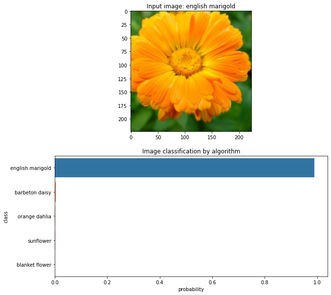

# Deep Learning Image Classifier

## Motivation
I strongly believe in the positive impact of AI, Deep Learning, and Computer Vision on our lives. 
From self-driving cars, to health care and early diagnosis.

I did this project during one of my Udacity nanodegrees, where my goal was to build this image classifier and train it on a dataset published by [University of Oxoford](http://www.robots.ox.ac.uk/~vgg/data/flowers/102/index.html).

I built it in a generic way, so you can use the model and retrain it on any similar dataset of your choice under MIT license.
You can work with provided Jupyter Notebook or use console applications I prepared and deploy it on your server.

## Project description: overview

The project uses Deep Learning based Image Classifier to categorize images. 

To train the image classifier against your dataset, the transfer learning is used. 
Pretrained VGG16 network is loaded and its classifier is replaced by our classifier taking into account the number of output labels your dataset has. 
This classifier is then retrained to classify your dataset.

The model performed with over 85% accuracy against the provided Oxford's Dataset after just 5 epochs of training.  

## Usage

### 1. Prepare your dataset
**1.1. Chose your dataset**

You can use [Oxford's Dataset with 102 flower categories](http://www.robots.ox.ac.uk/~vgg/data/flowers/102/index.html)

If you chose another one, keep in mind that the pre-trained network VGG16 expects to receive image input with size 224x224. It's easier to downsize your images to this size, rather than to increase it without side effects. 

**1.2. Prepare your dataset into the right folder structure**

For the model to work, you need to ensure that data are prepared in one folder with the following subfolders:
- `train` for training data
- `valid` for validation data used as intermediate feedback during training
- `test` for test data used to evaluate trained model performance

The referenced Oxford's Dataset fulfills it.  

### 2. Train the image classifier

You can train the classifier by executing training cell in Jupyter notebook or with the console application`

**Training with the console application `train.py:**
- Basic usage: run `python train.py --data_dir my_directory --output_cat 102`

- Mandatory parameters:
    - `--data_dir`. Description: Dataset directory used for training 
    - `--output_cat`. Description: Number of categories that the classifier needs to recognize

- Other parameters:
    - `--means`. Default value: `--means [0.485, 0.456, 0.406]` (taken from VGG dataset). Description: Image dataset means  
    - `--stds`. Default value: `--stds [0.229, 0.224, 0.225]` (taken from VGG dataset). Description: Image dataset stds  
    - `--arch`. Default value: `--arch vgg16`. Possible values: `--arch vgg16` or `--arch vgg13`. Description: Choose pretrained network architecture
    - `--save_dir`. Default value: `--save_dir assets/model/checkpoint_script.pth`. Description:  Directory to save trained model checkpoint 
    - `--learning_rate`. Default value: `--learning_rate 0.03`. Description: Learning rate used during the training  
    - `--epochs`. Default value: `--epochs 7`. Description: Learning epochs for the training 
    - `--device`. Default value: `--device cpu`. Possible values: `--device cpu` or `--device gpu`. Description: Computing device for training

### 3. Use the trained image classifier to recognize your images

You can use the classifier by executing predict cell in Jupyter notebook or with the console application 

**Predicting with the console application `predict.py`:**
- Basic usage: run `python predict.py --input "/path/to/image --checkpoint "checkpoint.pth"`

- Mandatory parameters:
    - `--input`. Description: Path to an image to be predicted 
    - `--checkpoint`. Description: Path to a checkpoint with a trained network to be used

- Other parameters:
    - `--top_k`. Default value: `--top_k 1`. Description: Return top K most likely classes
    - `--category_names`. Default value: `--category_names cat_to_name.json`. Description: File containing a mapping of categories to their real names
    - `--means`. Default value: `--means [0.485, 0.456, 0.406]` (taken from VGG dataset). Description: Image dataset means 
    - `--stds`. Default value: `--stds [0.229, 0.224, 0.225]` (taken from VGG dataset). Description: Image dataset stds 
    - `--device`. Default value: `--device cpu`. Possible values: `--device cpu` or `--device gpu`. Description: Computing device for prediction

## Libraries used
Python 3
- pandas
- numpy
- torch
- torchvision
- matplotlib
- seaborn
- PIL

## Files in the repository
- `Image Classifier Project.ipynb.py`: Jupyter Notebook File containing the whole code
- `train.py`: console applicating with functionality to retrain model for a dataset of your choice
- `predict.py`: console application with functionality to classify an image
- `cat_to_name.json`: contains the mapping between image categories and their real names

___
## Project description: detail steps
In the project:
- First, image dataset is loaded and preprocessed
- Second, image classifier is trained on the dataset
- Third, trained classifier is used to classify provided image

In the step loading and reprocessing the image dataset:
- Data are loaded through `torchvision`
- Next, data are split between training, validation, and testing. For training I've augmented data by applying transformations such as random scaling, cropping, and flipping to ensure that network is generalized and provides better performance.
- Lastly, means and standard deviations of the images are normalized to fit what the pre-trained network expects.

In the second step, to train the image classifier:
- Pre-trained network (VGG16) from `torchvision` is loaded
- Next, a new untrained `feed-forward network` as the classifier, using `ReLU activations`, `dropout` is created.
- Next, the classifier layer is trained using `backpropagation`. The project could be extended to use tracked Loss and accuracy on the validation set to determine the best hyperparameters. 
- The training required usage of `GPU computing` for which is torch perfect fit.

In the last step, to use the trained classifier to predict image content:
- input images are processed to fit the trained model, so they are resized and normalized first.
- Lastly, you can find there a function to predict the top 5 most probable classes with their probabilities. Results are visualized to the user in the form of a barplot graph.

Provided console applications allow you to deploy training and prediction directly on your server.
